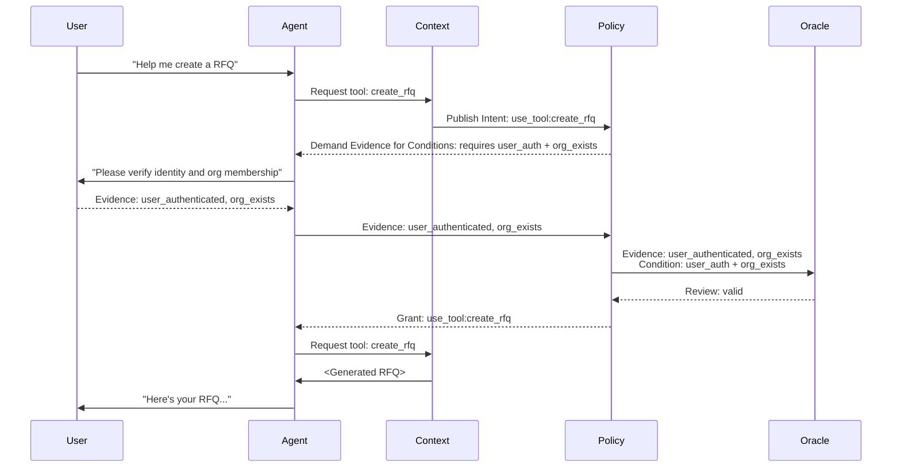

As I've learned more about building AI agents' I've realized that existing access control loops won't work as seamlessly as before for public facing agents. Those agents may need to escalate and de-escalate their permissions based on context. This is especially true in situations where an untrusted party is negotiating for some capability with the agent. Protologic is a concept for addressing that in a way that enables runtime negotiated policy checks and attestation like in the diagram below.

