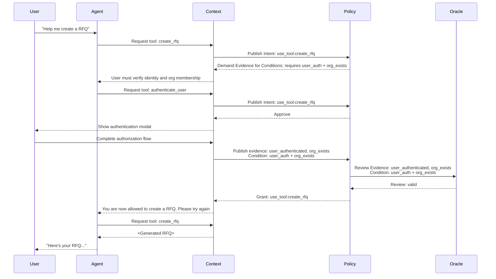

### Overview

Existing access control loops are unprepared for the demands of dynamic public facing agents. In situations where an untrusted party is negotiating for some capability with the agent, the agent may need to escalate and de-escalate their permissions based on context. At first glance, this problem seems simple enough to avoid; just don't make public facing agents that can perform actions that require a secure context. Tightly scope agents based on the access patterns of anticipated users, and provide different agents for different contexts.

But wouldn't it be a great user experience for an incoming user to ask a site agent how your company can help them, and also perform their first action without leaving the chat?

In order to enable this interaction, you'll need runtime policy checks and evidence attestation based on context. Your system can't inherently trust the agent, because it is subject to corruption by the user. It definitely can't trust the user because they have their own goals and motives (and may not even be human!).

Protologic is a concept for addressing these challenges by enabling runtime negotiated policy checks and attestation like in the diagram below.

